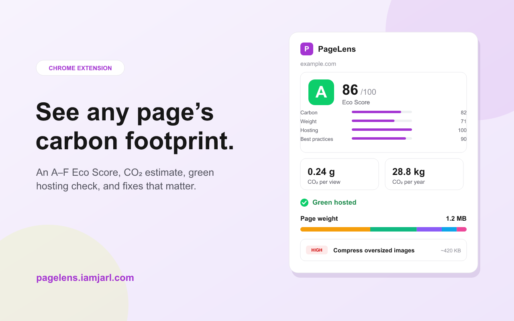

# PageLens

[](https://github.com/JarlLyng/PageLens/actions/workflows/ci.yml)
[](https://chromewebstore.google.com/detail/pagelens/mkajolhhjdlpmjlgdfnmbhfpbbeebgja)
[](LICENSE)

> See the carbon footprint of any web page — an actionable A–F Eco Score, right
> in your browser.

PageLens is a Chrome extension (Manifest V3) that estimates the digital carbon
footprint of the page you're viewing and turns it into a simple sustainability
score with concrete recommendations. It's built for developers, designers,
agencies and sustainability teams who want to make the web lighter.

🧩 **[Install from the Chrome Web Store](https://chromewebstore.google.com/detail/pagelens/mkajolhhjdlpmjlgdfnmbhfpbbeebgja)** · 🌐 **[pagelens.iamjarl.com](https://pagelens.iamjarl.com)**



## Features

- **Eco Score** — one 0–100 score, graded A–F, blending carbon, page weight,
  green hosting and best practices.
- **Carbon estimate** — grams of CO₂ per view plus a configurable yearly
  projection, via [CO2.js](https://www.thegreenwebfoundation.org/co2-js/)
  (Sustainable Web Design model).
- **Green hosting** — whether the site runs on green energy, via
  [The Green Web Foundation](https://www.thegreenwebfoundation.org/).
- **Page-weight breakdown** — transferred bytes by type (HTML, JS, CSS, images,
  fonts, video) and third-party share.
- **Recommendations** — a prioritized list of what to fix first.
- **Deep scan (opt-in)** — a DevTools-Protocol scan for exact transferred bytes
  and real unused JavaScript & CSS.

PageLens gives an **actionable estimate, not an exact measurement**, and is
transparent about how the score is calculated — see the in-popup Methodology and
[docs/ARCHITECTURE.md](docs/ARCHITECTURE.md).

## How it works

1. **Measure** — reads the page's transferred bytes via the browser's Resource
   Timing API.
2. **Estimate** — feeds those bytes to CO2.js, adjusted for green hosting.
3. **Score & advise** — turns the result into an A–F Eco Score with a
   plain-language list of improvements.

The **quick scan** needs no special permissions. The optional **deep scan**
attaches `chrome.debugger` and reloads the page to measure exact bytes and real
unused code — so it shows Chrome's debugger banner and is a dev-build feature
(the published Web Store build omits it for faster review).

## Getting started

Requires **Node 20+** (see [`.nvmrc`](.nvmrc)).

```bash
npm install
npm run dev     # HMR build → dist/, hot-reloads the loaded extension
npm run build   # production build → dist/
npm test        # unit tests (vitest)
npm run lint    # eslint
npm run format  # prettier --write
```

**Load it in Chrome:** open `chrome://extensions`, enable **Developer mode**,
click **Load unpacked**, and select the `dist/` folder.

## Project structure

```
src/
  core/          Pure, framework-free analysis engine (unit-tested)
                 classify · aggregate · carbon · score · recommendations · coverage
  background/    MV3 service worker + chrome.debugger deep scan
  content/       Injected Performance-timing collector
  popup/         React UI (components, hooks)
  lib/           Messaging, Green Web Foundation client, storage, settings
tests/           Vitest suites for core/ (incl. score calibration)
site/            Marketing site (Vite + React) → pagelens.iamjarl.com
docs/            Architecture & Chrome Web Store guides
scripts/         Dependency-free icon generator
```

The analysis logic in `src/core/` is deliberately pure — no `chrome.*` or DOM
access — which keeps it fully unit-testable. Chrome APIs live only at the edges.

## Tech stack

React · TypeScript · Vite · [`@crxjs/vite-plugin`](https://crxjs.dev/) ·
Tailwind CSS · Chrome MV3 · CO2.js · Green Web Foundation API

Styling uses the [iamjarl-design](https://github.com/JarlLyng/iamjarl-design)
token system, mapped onto Tailwind and auto-switching light/dark.

## Quality

Every push and PR runs lint, format check, type-check, unit tests, and a
production build via [CI](.github/workflows/ci.yml). The Eco Score thresholds
live in `src/core/constants.ts` and are pinned by
[`tests/calibration.test.ts`](tests/calibration.test.ts).

## Publishing

The published build omits the `debugger` permission:

```bash
npm run package:store   # → pagelens-store.zip from a debugger-free dist-store/
```

See [docs/chrome-store-listing.md](docs/chrome-store-listing.md) for the full
release process and [PRIVACY.md](PRIVACY.md) /
[the hosted policy](https://pagelens.iamjarl.com/privacy.html).

## Contributing

Contributions are welcome — see [CONTRIBUTING.md](CONTRIBUTING.md) and the
[Code of Conduct](CODE_OF_CONDUCT.md). For security issues, see
[SECURITY.md](SECURITY.md).

## License

[MIT](LICENSE) © IAMJARL
